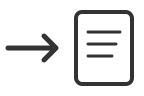
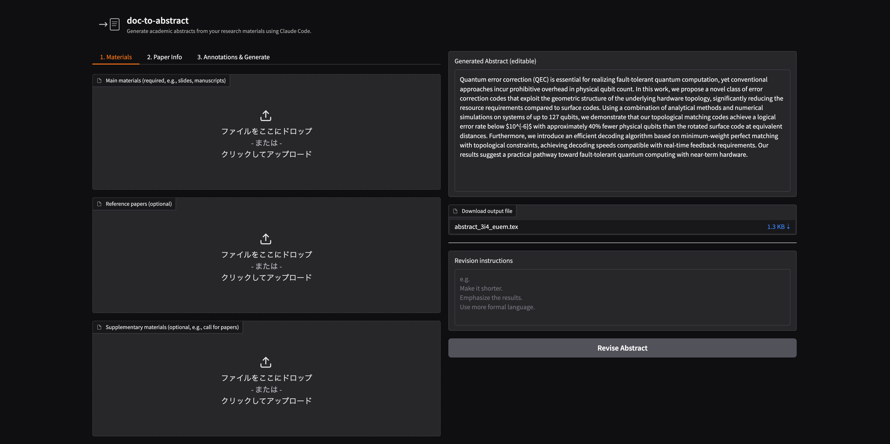
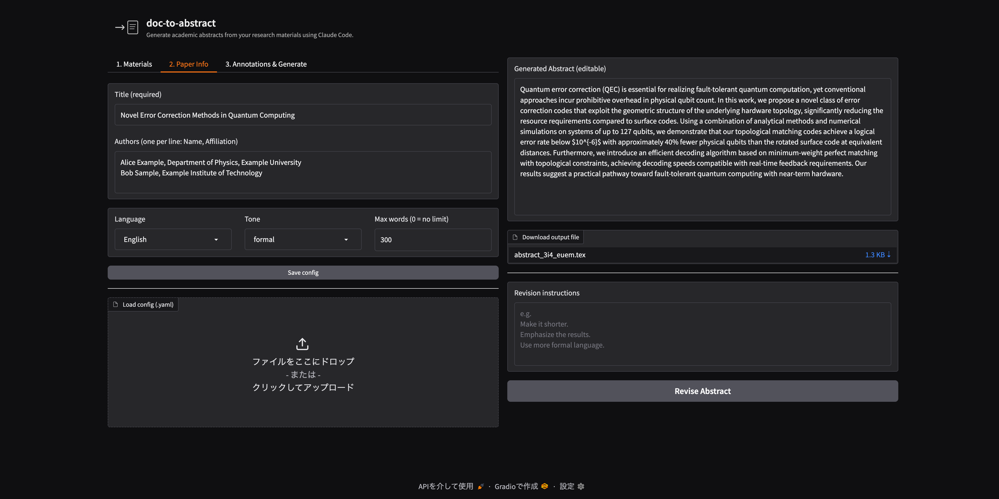
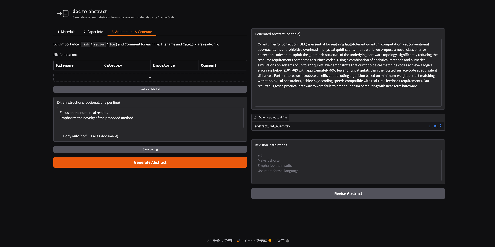

<p align="center">
  
</p>

<h1 align="center">doc-to-abstract</h1>

<p align="center">Generate academic abstracts from your research materials using Claude Code.</p>

A CLI + Web UI tool for researchers to quickly generate conference/workshop/research meeting abstracts from various materials (manuscripts, slides, notes, etc.).

## Screenshots

**Materials**


**Paper Info**


**Generate & Revise**


## How It Works

```
materials (.pdf/.pptx) + refs + supplementary ──> [text extraction] ──> [Claude Code] ──> abstract.tex
```

1. Text is extracted from your materials (PDF via PyMuPDF, PPTX via python-pptx)
2. The extracted text is combined with your paper metadata (title, authors, etc.) into a prompt
3. Claude Code generates an academic abstract
4. The result is output as a LaTeX file

## Prerequisites

- [Node.js](https://nodejs.org/) >= 18
- [Claude Code CLI](https://docs.anthropic.com/en/docs/claude-code)
- Python >= 3.11
- [uv](https://docs.astral.sh/uv/)

### Install Prerequisites

```bash
# Install Claude Code CLI
npm install -g @anthropic-ai/claude-code

# Install uv (if not already installed)
curl -LsSf https://astral.sh/uv/install.sh | sh
```

## Setup

### Using as a GitHub Template

1. Click **"Use this template"** on GitHub to create your own repository
2. Clone your new repository
3. Install dependencies:

```bash
uv sync
```

### Manual Installation

```bash
git clone https://github.com/cohsh/doc-to-abstract.git
cd doc-to-abstract
uv sync
```

## Quick Start

### Web UI

```bash
uv run doc-to-abstract serve
```

Open http://localhost:7860 in your browser. The UI has 3 tabs:

1. **Materials** - Upload main materials, references, supplementary materials, and templates (.pdf / .pptx)
2. **Paper Info** - Enter title, authors, language, tone, and word limit
3. **Annotations & Generate** - Set importance/comments per file, add extra instructions, and generate

#### Revising the Abstract

After generating, you can refine the abstract without starting over:

- **Direct editing** - The generated abstract is editable. Changes are auto-saved to `doc-to-abstract.yaml`
- **Revise Abstract** - Enter revision instructions (e.g., "Make it shorter", "Emphasize the results") and click **Revise Abstract** to have Claude Code revise the current abstract. Multi-line instructions are supported (Shift+Enter)

#### Session Persistence

Your work is automatically saved and restored across server restarts:

- **Save config** button (available in every tab) saves all settings and copies uploaded files to `materials/` directory
- **Generate** also auto-saves before generating
- The generated abstract is saved to `doc-to-abstract.yaml` and restored on startup
- On startup, settings and the last abstract are automatically restored from `doc-to-abstract.yaml` if it exists
- You can also load a different config via **Load config** in Tab 2

This means you can work on an abstract across multiple days without losing progress.

### CLI

1. Create a configuration file:

```bash
uv run doc-to-abstract init
```

2. Edit `doc-to-abstract.yaml` with your paper details:

```yaml
title: "My Research Title"
authors:
  - name: "Alice Example"
    affiliation: "Example University"
materials:
  - "manuscript.pdf"
language: "English"
```

3. Generate the abstract:

```bash
uv run doc-to-abstract generate
```

4. Find the output in `abstract.tex`

## Configuration

All settings are defined in `doc-to-abstract.yaml`.

### Required Fields

| Field | Description |
|-------|-------------|
| `title` | Title of your paper |
| `authors` | List of authors, each with `name` and `affiliation` (and optional `email`) |
| `materials` | Path(s) to main materials (.pdf / .pptx). Can be a single string or a list. Legacy `slides` and `slides_pdf` are also supported |

### Optional Fields

| Field | Default | Description |
|-------|---------|-------------|
| `language` | `"English"` | Language for the abstract |
| `tone` | `"formal"` | Writing tone: `formal`, `semi-formal`, or `casual` |
| `max_words` | (none) | Maximum word count (mutually exclusive with `max_characters`) |
| `max_characters` | (none) | Maximum character count (mutually exclusive with `max_words`) |
| `references` | `[]` | List of reference paper paths (.pdf / .pptx) for context and style |
| `supplementary` | `[]` | List of supplementary material paths (.pdf / .pptx, e.g., call for papers) |
| `template` | `""` | Conference/workshop template file (`.tex`, `.docx`, or `.pdf`). Used to understand format requirements. For `.tex`/`.docx`, the abstract is also inserted into a copy |
| `output` | `"abstract.tex"` | Output file path |
| `extra_instructions` | `[]` | List of additional instructions for the LLM. A single string is also accepted |
| `annotations` | `{}` | Per-file importance (`high`/`medium`/`low`) and comments, keyed by filename |
| `generated_abstract` | `""` | Previously generated abstract text (auto-saved by Web UI) |

### Example

```yaml
title: "Novel Error Correction Methods in Quantum Computing"

authors:
  - name: "Alice Example"
    affiliation: "Department of Physics, Example University"
    email: "alice@example.com"
  - name: "Bob Sample"
    affiliation: "Example Institute"

materials:
  - "presentation.pdf"

language: "English"
tone: "formal"
max_words: 300

references:
  - "refs/related-work.pdf"

supplementary:
  - "cfp.pdf"

template: "conference-template.tex"
output: "abstract.tex"

extra_instructions:
  - "Focus on the numerical results."
  - "Emphasize the novelty of the proposed method."

annotations:
  "presentation.pdf":
    importance: "high"
    comment: "Focus on the results section"
  "refs/related-work.pdf":
    importance: "low"
    comment: "Background context only"
```

## CLI Reference

```bash
# Create a sample config file
uv run doc-to-abstract init

# Generate abstract (reads doc-to-abstract.yaml by default)
uv run doc-to-abstract generate

# Specify a different config file
uv run doc-to-abstract generate my-config.yaml

# Override options via CLI flags
uv run doc-to-abstract generate --language Japanese --max-words 200

# Multiple main materials (.pdf or .pptx)
uv run doc-to-abstract generate --materials doc1.pdf --materials doc2.pptx

# Add supplementary materials (e.g., call for papers)
uv run doc-to-abstract generate --supplementary cfp.pdf

# Add extra instructions
uv run doc-to-abstract generate --extra-instructions "Focus on results."

# Use a conference template (.tex or .docx)
uv run doc-to-abstract generate --template conference-template.tex

# Output only the \begin{abstract}...\end{abstract} block
uv run doc-to-abstract generate --body-only

# Launch Web UI
uv run doc-to-abstract serve
uv run doc-to-abstract serve --port 8080

# Show version
uv run doc-to-abstract --version
```

### `generate` Options

| Option | Description |
|--------|-------------|
| `CONFIG_FILE` | Path to YAML config (default: `doc-to-abstract.yaml`) |
| `--materials PATH` | Main material path(s) (.pdf / .pptx); can be repeated |
| `--supplementary PATH` | Supplementary material(s) (.pdf / .pptx); can be repeated |
| `--template PATH` | Conference/workshop template file (`.tex`, `.docx`, or `.pdf`) |
| `--output, -o PATH` | Override output file path |
| `--language TEXT` | Override language |
| `--tone TEXT` | Override tone |
| `--max-words INT` | Override max word count |
| `--max-characters INT` | Override max character count |
| `--extra-instructions TEXT` | Extra instruction(s); can be repeated |
| `--body-only` | Output only the abstract block |

## Output

By default, the tool generates a complete LaTeX document:

```latex
\documentclass{article}
\usepackage[utf8]{inputenc}

\title{My Research Title}
\author{
  Alice Example \\
  Department of Physics, Example University
\and
  Bob Sample \\
  Example Institute
}
\date{}

\begin{document}
\maketitle

\begin{abstract}
(Generated abstract text here)
\end{abstract}

\end{document}
```

With `--body-only`, only the abstract block is output for pasting into your existing document.

## License

MIT
